# Sosyal Medya ve Link Yönetim Uygulaması

### Proje Açıklaması

Bu proje kullanıcıların sosyal medya linklerini ve bu linklerle ilgili bilgileri daha etkili bir şekilde düzenlemelerini ve yönetmelerini kolaylaştırmayı amaçlıyor.

#### Proje Yapısı

---

Proje Kurulumu

- Aşağıdaki komut ile projeyi lokalinize klonlayın.

    - git clone [https://github.com/Esmahr/social-media-link-management.git](https://github.com/Esmahr/social-media-link-management.git)

## Backend
- Clonlanan proje içerisindeki backend projesini vsCode'da açın.
- Açılan projenin terminalinde ` npm install ` komutu ile npm paketini indirin.
- Paket indikten sonra ` docker-compose up -d `  komutu ile docker container larınızı oluşturun.  
- Docker desktop uygulamasını açın.
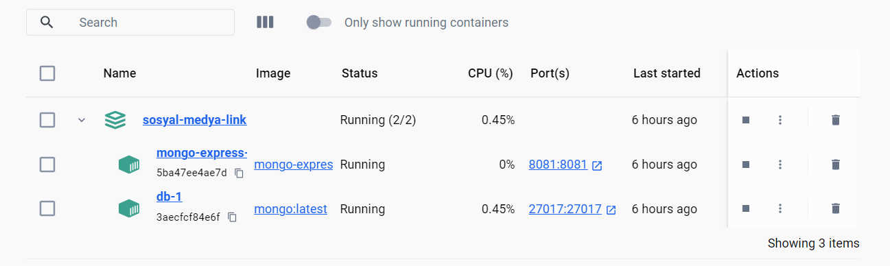   
- Proje terminalinde ` npm start ` komutu ile projeyi lokalinizde ayağa kaldırın.
- Docker desktopda oluşan **_sosyal-medya-link-yonetimi-backend_** container ında port alanından MongoDb veritabanı portunuzu tarayıcıda açın.
    * MongoDb Url: **_http://localhost:8081/_**
    * username: esma
    * password: esma

     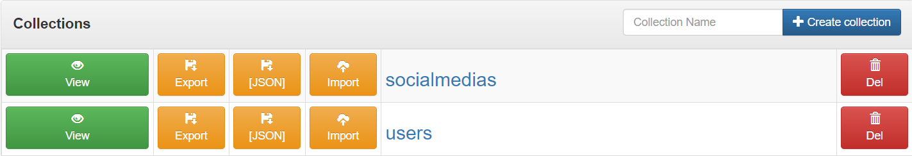

     ---

     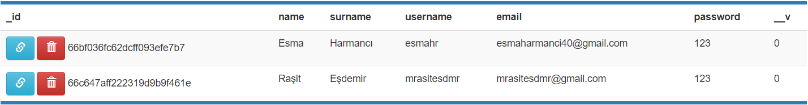

     ---

     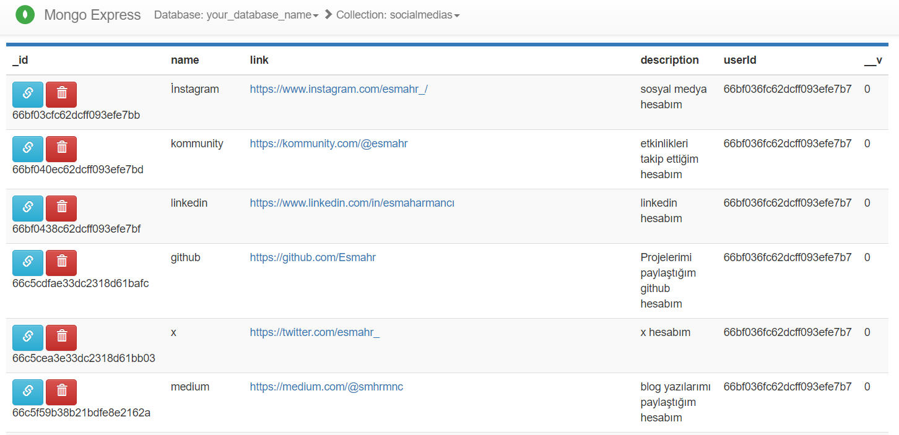
- Backend isteklerini test etmek için; 
    * Postman Collection : https://github.com/Esmahr/social-media-link-management/tree/main/postman
    * Swagger Url: http://localhost:5000/api-docs/#/

## Frontend
- Clonlanan proje içerisindeki frontend projesini vsCode'da açın.
- Açılan projenin terminalinde ` npm install ` komutu ile npm paketini indirin.
- Paket indikten sonra ` ng serve ` komutu ile projeyi lokalinizde ayağa kaldırın.
- Tarayıcınızda **_http://localhost:4200/_** portu ile projeye ulaşabilirsiniz.

---

Proje Kullanımı

- Register Ekranı
    * Proje localde çalıştıktan sonra açılan sayfada register alanında bilgilerinizi doldurarak üye olunuz.
    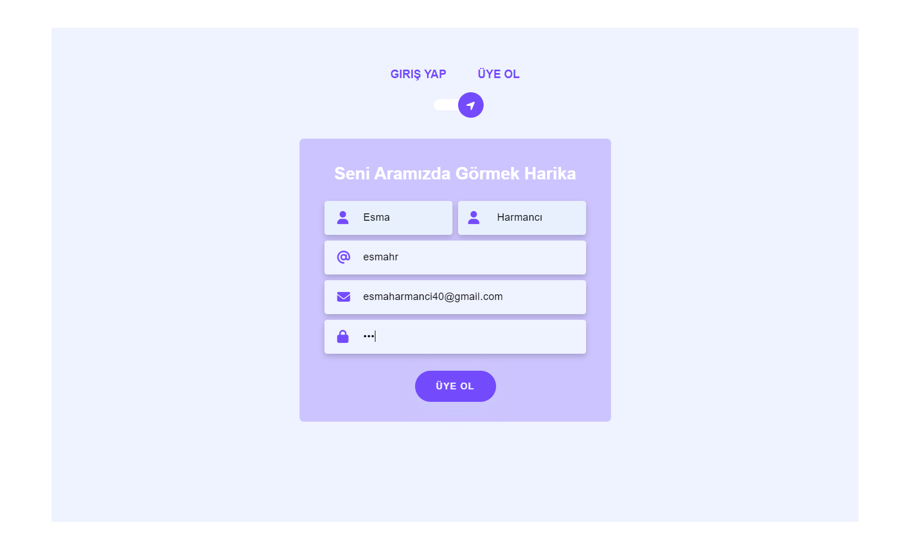
    * Üye olduktan 2 saniye sonra login ekranına yönlendirileceksiniz.
- Login Ekranı
    * Login alanında bilgilerinizi doldurarak giriş yapınız.
     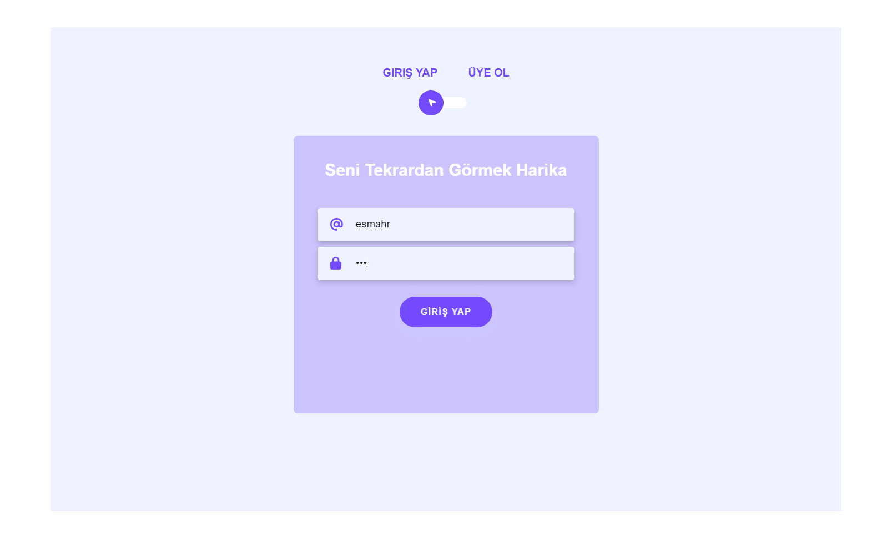

- Home Ekranı
    * Login olduktan sonra home ekranına yönlendirileceksiniz.
     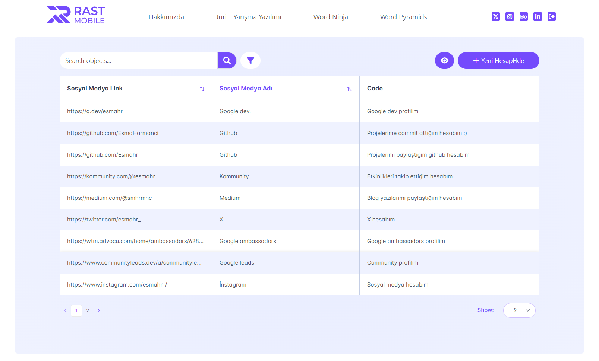
    * Anasayfada sağ üst köşede bulunan **Çıkış Yap** ikonuna tıklayarak hesabınızdan çıkış yapabilirsiniz.
    * Anasayfanızda mevcut sosyal medya linklerinizi görüntüleyebilir ve bu linkler içinde arama işlemini yapıp sıralama yapabilirsiniz.
     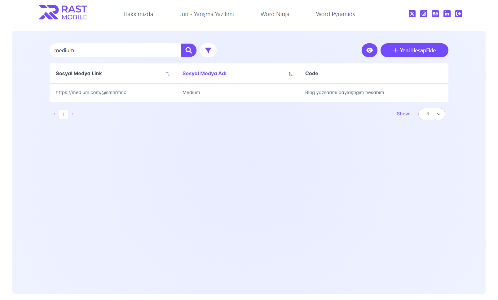
    * Ayrıca bu sayfada temel crud işlemlerinizi yapabilirsiniz.
        - **Yeni sosyal medya linki ekleme**
            - Ana sayfada, sağ üst köşede bulunan **Yeni Ekle** butonu ile sosyal medya linki ekleyebilirsiniz
             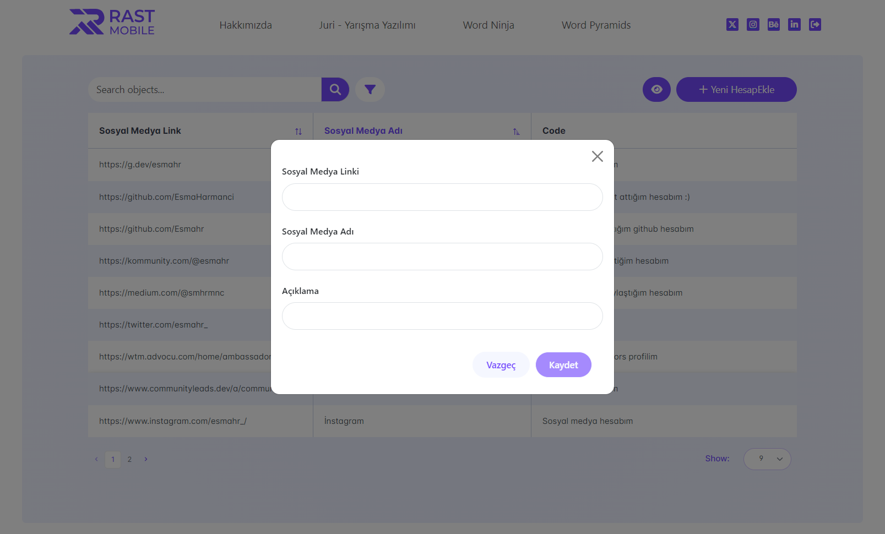
             - Yeni sosyal medya linki ekleme
        - **Sosyal Medya Bilgilerini Güncelleme ve Silme**
             - Ana sayfada, tablo içerisinde düzenlemek istediğiniz satıra tıklayınız.
             - Açılan modal da mevcut bilgilerinizi görüntüleyebilir, **Kaydet** butonu ile güncelleyebilir veye **Sil** butonu ile silebilirsiniz.
             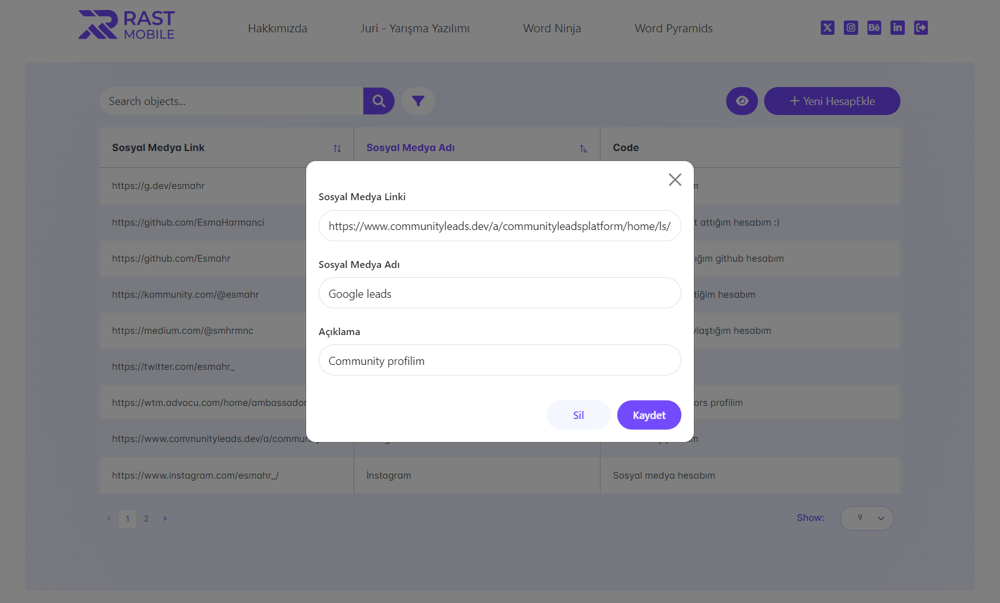
        - **Son Ziiyaret Edilen Linkler**
             - Yeni ekle butonu yanında bulunan **view** butonuna tıklayarak en son ziyaret ettiğiniz linklerinizi görüntüleyebilirsiniz.
             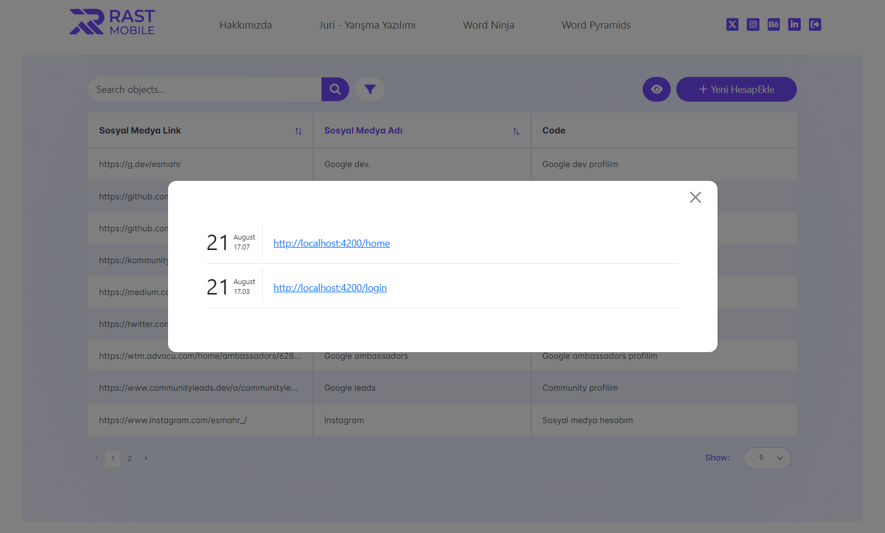

---

Değerlendirme Kriterleri Tamamlanma Durumları

* [x] Projeden ne anladığınızı ve hangi adımları izleyerek ilerlediğinizi bir doküman olarak yazıp proje içerisine ekleyiniz (15P)
* [x] Angular'da kodları component ve service’lere bölün (15P)
* [x] Tasarımı responsive olarak kodlayın (10p)
* [x] API NodeJS ve express kullanarak oluşturulmalı (20P)
* [x] Verileri bir veritabanında (MongoDB, MySQL,…) kalıcı olarak saklayın (10p)
* [x] Restful API tasarım kurallarına dikkat edilmeli (5p)
* [x] Veri nesneleri için model ve interfaceleri tanımlayın (10p)
* [x] Oluşturduğunuz API’leri bir postman collection olarak projeye ekleyin (5p)
* [x] Karmaşık kod bloklarınız için yorumları unutmayın (5p)
* [x] Kolayca çalıştırabilmemiz için readme dosyasında gerekli yönergeleri bulundurun (5p)
* [x] (Bonus) Kullanıcının ziyaret ettiği sayfaları kullanıcının lokalinde saklayın ve son gezdiklerim listesi oluşturup ekranın bir köşesinde gösterin (10p)

Toplam puan: :smirk: 100 

